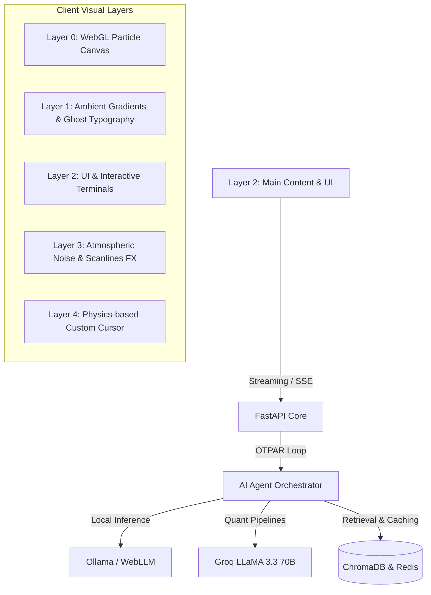

# ⚡ Nexus3D — Premium Creative Portfolio

<p align="center">
  
  
  
</p>

---

## 🌌 Overview

**Nexus3D** is a premium, highly cinematic interactive portfolio designed for **Chandradeep Saxena** — Full-Stack & AI Systems Developer. 

Built with zero frameworks, zero bundlers, and zero build steps. It is a testament to pure engineering performance and visual storytelling, utilizing **WebGL**, **custom physics particles**, **GSAP scroll triggers**, and **atmospheric effects** (noise, scanlines, and glow layers).

---

## ⚡ MVPs & Core Features

### 1. Astra-OS — Local-First Personal AI OS
A fully offline, agentic OS running entirely in the client with zero cloud dependency. Built on top of the **OTPAR Loop** (Observe → Think → Plan → Act → Reflect) for self-correcting task execution.
*   **Vector Memory**: Powered by ChromaDB for persistent session context.
*   **On-Device Inference**: Utilizes Ollama and WebLLM for completely private processing.
*   **OTPAR Terminal Simulator**: An interactive neural interface terminal that simulates real-time agent execution loop and self-reflection.

### 2. ARTH — AI Financial Intelligence Platform
An institutional-grade quant and research platform delivering low-latency financial insights.
*   **Technical Indicators Engine**: Calculates RSI, MACD, Bollinger Bands, and VWAP metrics.
*   **SSE Streams**: Delivers real-time AI stock reports via Server-Sent Events with zero buffering.
*   **Resiliency Layer**: Implements circuit-breaker patterns and aggressive Redis TTL caching under high request volume.
*   **Quant Terminal Simulator**: Interactive pipeline typing out real-time market queries, risk scoring, and streaming analysis.

---

## 📐 Architecture & Visual Layers



---

## 🧬 Design System & Styling Tokens

Nexus3D runs on a customized CSS utility framework utilizing high-end design tokens for spacing, coloring, and animations.

| CSS Variable | Color | Hex Value | Purpose |
| :--- | :--- | :--- | :--- |
| `--bg` | Dark Obsidian | `#050505` | Base canvas background |
| `--surface` | Elevated Metal | `#0f0f0f` | Cards, terminal boxes, and nodes |
| `--text` | Warm Silver | `#e8e6e1` | High-contrast typography |
| `--accent` | Cyber Green | `#00ff87` | Interactive states, primary triggers, and success states |
| `--accent2` | Electric Blue | `#0066ff` | Secondary highlights and compute phases |
| `--accent3` | Crimson Rose | `#ff3c5c` | Warning states, circuit breakers, and reflect triggers |

### Typography
-   **Display (Titles)**: `Syne` (800 weight) — aggressive, cinematic fonts.
-   **Mono (Labels & Code)**: `Fragment Mono` / `Space Mono` — sharp, technological fonts.

---

## 🚀 Performance Degradation Engine

To guarantee 60 FPS on any device (from a high-end gaming desktop to a budget mobile phone), Nexus3D runs a **3-tier automated performance engine**:

```
[High Performance] ──(FPS < 40 for 10s)──> [Mid Performance] ──(FPS < 40)──> [Low Performance]
  • 180 Particles                              • 100 Particles                   • 50 Particles
  • Full Canvas Blurs                          • Canvas Blurs Disabled           • Custom Cursor Disabled
  • Physics Interactions                       • Reduced Parallax                • Parallax & Smooth Scroll Disabled
```

---

## 🛠️ Folder Structure

```
nexus3d-portfolio/
├── index.html                 # Main entry point (semantic HTML5 & ARIA labels)
└── src/
    ├── styles/                # CSS Modular Architecture
    │   ├── tokens.css         # Design tokens & color variables
    │   ├── reset.css          # Base reset & accessibility skip-link
    │   ├── layers.css         # Noise, scanline overlays & ambient gradients
    │   ├── terminal.css       # Astra & ARTH terminal interface layout
    │   └── responsive.css     # Responsive layouts & reduced-motion settings
    ├── scripts/               # Pure Vanilla JS Modules
    │   ├── state.js           # Central AppState manager (pub/sub pattern)
    │   ├── performance.js     # Live FPS counter & auto-degradation logic
    │   ├── terminal.js        # Astra-OS OTPAR simulation engine
    │   └── arth-terminal.js   # ARTH Quant & SSE streaming simulation engine
    └── animations/            # GSAP Motion Engines
        ├── typography.js      # Letter-by-letter & word-by-word reveals
        └── sections.js        # ScrollTrigger section transitions & parallax
```

---

## 💻 Quick Start

To run the portfolio locally, you need to serve it using any local web server (needed for Web Workers and ES modules):

### Python (Recommended)
```bash
python -m http.server 8080
```

### Node.js (Alternative)
```bash
npx serve .
```

Then open **[http://localhost:8080](http://localhost:8080)** in your browser.

---

<p align="center">
  Designed & Engineered by <b>Chandradeep Saxena</b> © 2026. All Rights Reserved.
</p>
